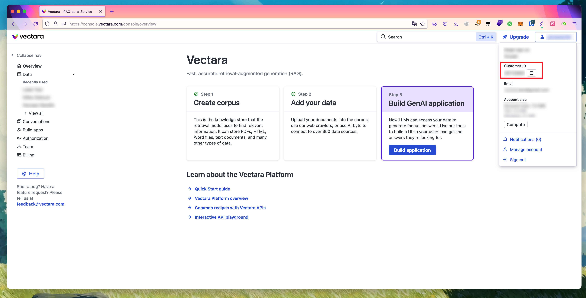

# Mercury

> [!NOTE]
> WIP: This project is under active development

An interface for data labeling, where the user can select two pieces of text from the article and summary, respectively, to label whether they match or not.

We currently use Vectara for highlighting, where the backend can help highlight potentially relevant statements ahead of time as the user selects them, and differentiate the relevant levels by background color.

## Usage

> [!NOTE]
> You need Python and Node.js.

As mentioned before, we use Vectara, you need to set the following environment variables first:

- `VECTARA_CUSTOMER_ID`: In the vectara console, you can find it:

    

- `VECTARA_CORPUS_ID`: You need create a corpus first, this can be copied in the corpus details page.
- `VECTARA_API_KEY`: You need create a personal api key ([click here](https://console.vectara.com/console/apiAccess/personalApiKey)), and copy it.

You can also write the above environment variables to `.env`.

And create a config file called `config.json`, copy `config.example.json`, fill your own RAGTruth repo path.

Once everything is complete, you can start Mercury by following these steps:

1. `pip3 install -r requirements.txt`
2. `pnpm install && pnpm build` (if you don't have `pnpm` installed: `npm install -g pnpm`)
3. `python3 server.py`
